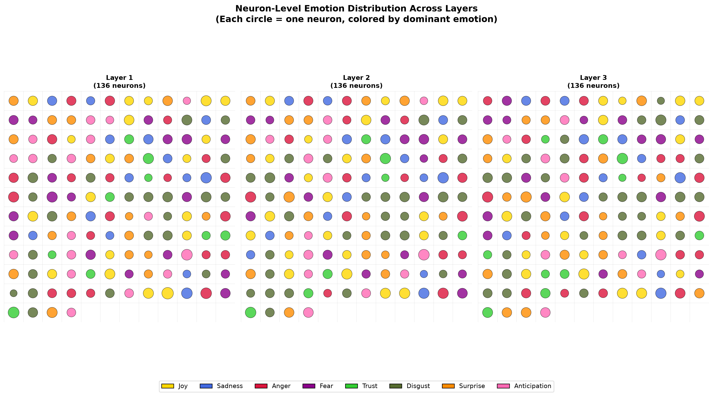
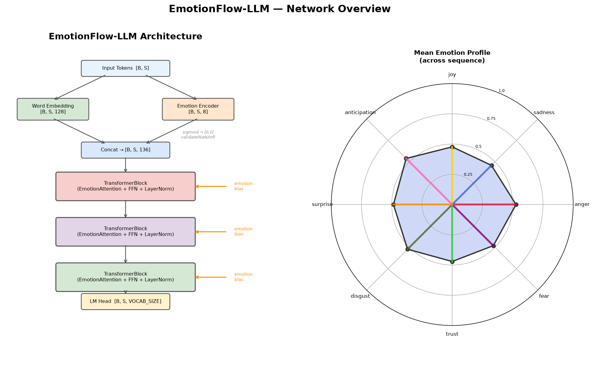
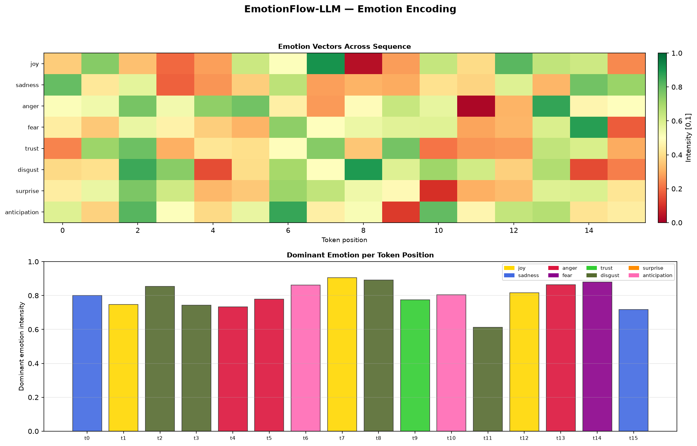
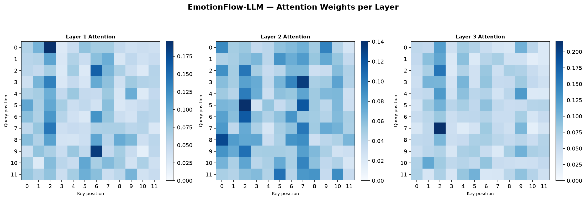
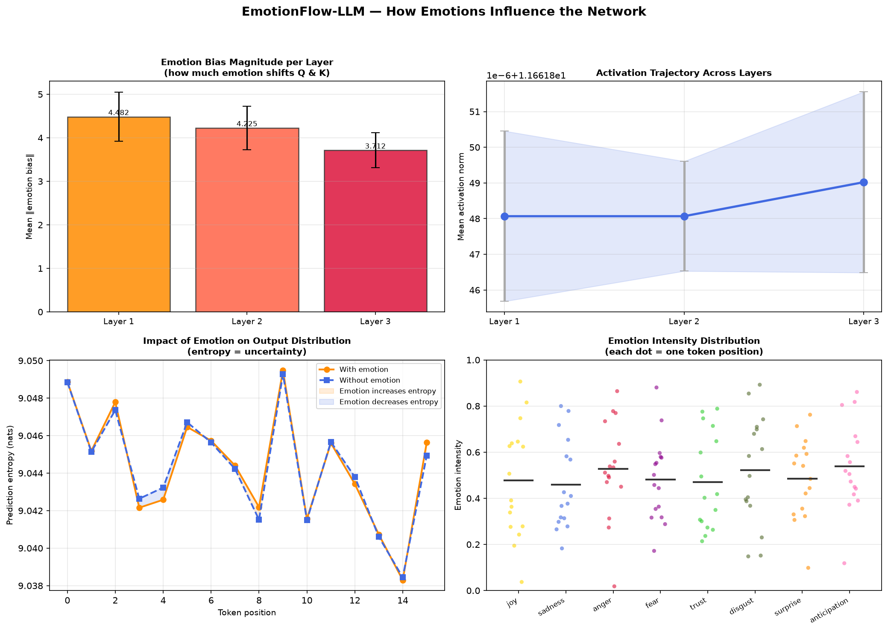
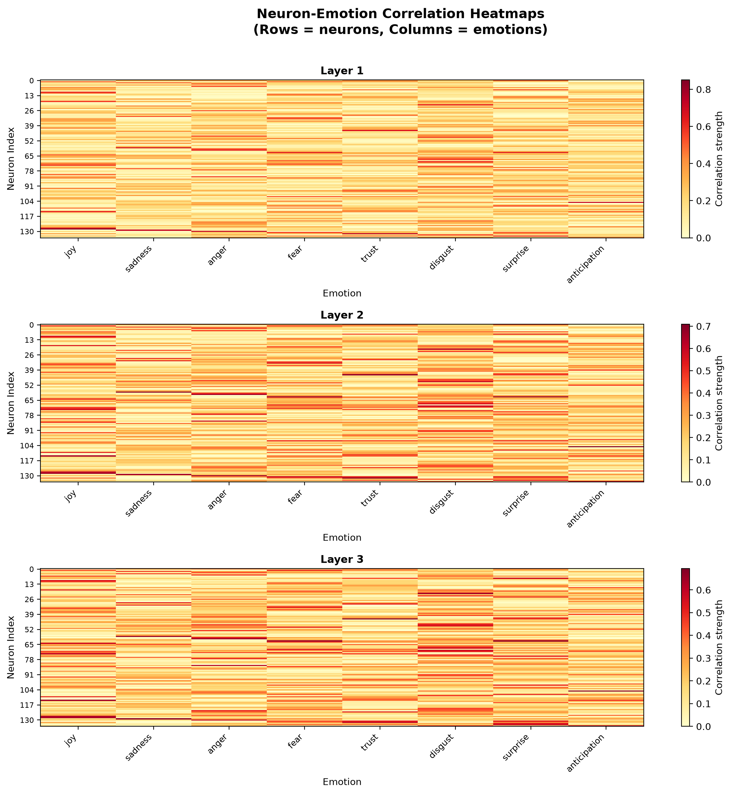
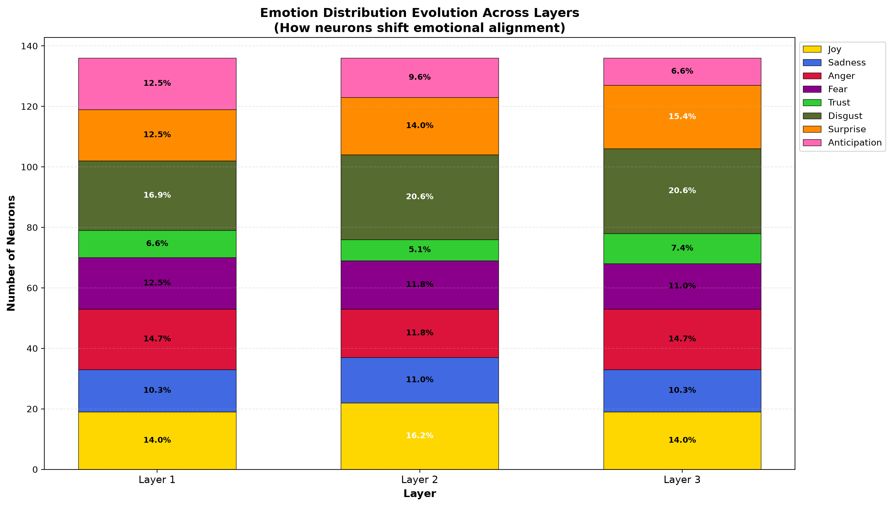
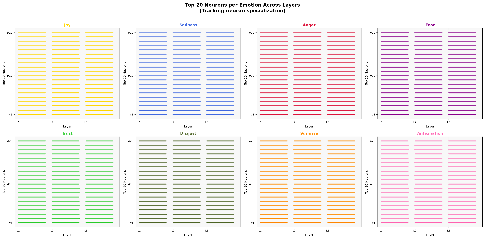

# EmotionFlow-LLM 🎭

> An experimental transformer architecture that integrates emotional awareness into language generation

[](https://www.python.org/downloads/)
[](https://pytorch.org/)
[](LICENSE)



---

## 🌟 Key Features

- 🧠 **Emotion-Aware Attention**: Modifies transformer attention using 8-dimensional emotion vectors
- 🎨 **Plutchik's Wheel**: Based on established emotion theory (joy, sadness, anger, fear, trust, disgust, surprise, anticipation)
- 🔍 **Interpretable Trajectories**: Track how emotions evolve across transformer layers
- 🎲 **Multi-Sample Generation**: Generate 20 diverse candidates with emotion profiling
- 📊 **Rich Visualizations**: Neuron-level emotion coloring, heatmaps, attention patterns, and more
- 🔬 **Neuron-Level Analysis**: See how individual neurons specialize in different emotions

---

## 🚀 Quick Start

### Installation

```bash
# Clone the repository
git clone https://github.com/natiBirhauz/EmotionFlow-LLM.git
cd EmotionFlow-LLM

# Install dependencies
pip install torch matplotlib numpy scikit-learn
```

### Run Demo

```bash
# Run the main demo
python emotionflow_llm.py

# Generate standard visualizations
python visualize.py

# Generate neuron-level emotion visualizations (NEW!)
python neuron_emotion_viz.py
```

### Expected Output

```
======================================================================
EmotionFlow-LLM Demo
======================================================================

Device: cpu
Model configuration:
  - Vocabulary size: 10000
  - Word dimension: 128
  - Emotion dimension: 8
  - Transformer layers: 3
  - Model dimension: 136

Total parameters: 3,348,936

Generated 5 samples
Emotion analysis:
  Output 1:         fear (length: 30)
  Output 2:         fear (length: 30)
  Output 3:        anger (length: 30)
  ...
```

---

## 🏗️ Architecture

### Overview

EmotionFlow-LLM combines standard word embeddings with learned emotion embeddings, then modifies the transformer's attention mechanism to incorporate emotional context.

```
Input Text
    ↓
[Token Embedding]
    ├─→ Word Embeddings (128-dim)
    └─→ Emotion Embeddings (8-dim)
         ↓
    Concatenate → (136-dim)
         ↓
[Emotion-Aware Transformer × 3]
         ↓
[Language Model Head]
         ↓
[Multi-Sample Generation]
         ↓
    Final Output
```

### Emotion-Aware Attention

The key innovation: emotion vectors modify queries and keys in the attention mechanism:

```python
emotion_bias = Linear(emotion)
Q' = Q + emotion_bias
K' = K + emotion_bias
attention_scores = softmax(Q' @ K'.T / √d) @ V
```

**Result:** Tokens with similar emotional context attend more strongly to each other.

---

## 📊 Visualizations

### Standard Visualizations (`python visualize.py`)


*Network architecture and emotion radar chart*


*Emotion heatmaps and dominant emotions per token*


*Attention weight matrices across all layers*


*Emotion bias magnitude, activation trajectories, and entropy impact*

### Neuron-Level Visualizations (`python neuron_emotion_viz.py`)


*Each neuron colored by its dominant emotion - shows emotional specialization*


*Correlation between individual neurons and emotions*


*How emotion distribution changes across layers*


*Top neurons for each emotion tracked across layers*

---

## 💻 Usage Examples

### Basic Generation

```python
from emotionflow_llm import EmotionFlowLLM, generate

model = EmotionFlowLLM()
prompt = torch.randint(0, VOCAB_SIZE, (1, 10))
output = generate(model, prompt, max_len=20, temperature=0.9)
```

### Multi-Sample Generation

```python
from emotionflow_llm import generate_samples, emotion_profile

# Generate 20 candidates
samples = generate_samples(model, prompt, n=20)

# Analyze emotions
for i, sample in enumerate(samples):
    emotion = emotion_profile(model, sample)
    print(f"Sample {i}: {emotion}")
```

### Emotion Trajectory

```python
from emotionflow_llm import collect_emotion_trajectory

model(tokens)  # Forward pass
trajectory = collect_emotion_trajectory(model)
print(f"Layer activations: {trajectory}")
```

---

## 🔬 How It Works

### 1. Emotion Vectors

Each token receives an 8-dimensional emotion vector:

```python
emotion_vector = [joy, sadness, anger, fear, trust, disgust, surprise, anticipation]
# All values in [0, 1] via sigmoid activation
```

### 2. Emotion Encoding

The `EmotionEncoder` learns to map token IDs to emotion space:

```python
class EmotionEncoder(nn.Module):
    def __init__(self, vocab_size, emotion_dim=8):
        self.embedding = nn.Embedding(vocab_size, emotion_dim)
    
    def forward(self, tokens):
        emotions = torch.sigmoid(self.embedding(tokens))
        return self.validate(emotions)  # Clamp, handle NaN/inf
```

### 3. Neuron Specialization

Individual neurons in hidden layers specialize in different emotions. The neuron visualization shows:
- **Color-coded neurons**: Each neuron's dominant emotion
- **Size indicates strength**: Larger circles = stronger emotion correlation
- **Layer evolution**: How neurons shift emotional alignment across layers

---

## 📈 Model Specifications

| Component | Dimensions | Parameters |
|-----------|-----------|-----------|
| Vocabulary | 10,000 tokens | - |
| Word Embeddings | 128-dim | 1,280,000 |
| Emotion Embeddings | 8-dim | 80,000 |
| Transformer Layers | 3 layers | ~2,000,000 |
| Model Dimension | 136-dim | - |
| **Total Parameters** | - | **3,348,936** |

---

## 🎯 Research Motivation

### The Problem

Traditional language models encode semantic meaning but ignore emotional context. This limits:
- Emotional coherence in generated text
- Interpretability of model reasoning
- Controllability of narrative tone
- Human-like communication

### Our Approach

EmotionFlow-LLM integrates emotion **during** generation, not as post-processing:

1. **Explicit representation**: 8-dimensional emotion vectors
2. **Attention modification**: Emotion influences token relationships
3. **Trajectory tracking**: Interpretable emotion evolution
4. **Neuron specialization**: Individual neurons develop emotional preferences
5. **Multi-sample exploration**: Diverse emotional reasoning paths

### Key Insight

> Emotion isn't just a property of text—it's a feature that guides reasoning, attention, and generation at the neuron level.

---

## 🔗 Related Work

- **Plutchik (1980)**: Wheel of Emotions - theoretical foundation
- **Mohammad & Turney (2013)**: NRC Emotion Lexicon
- **Vaswani et al. (2017)**: Transformer architecture
- **Zhou et al. (2018)**: Emotional Chatting Machine
- **Poria et al. (2019)**: Emotion recognition in conversation

### Our Contribution

EmotionFlow-LLM differs by:
- Integrating emotion **during** attention computation (not post-hoc)
- Providing neuron-level emotion analysis
- Enabling interpretable emotional trajectories
- Maintaining standard transformer compatibility

---

## 📚 Documentation

- **[EXPLANATION.md](EXPLANATION.md)**: Technical deep dive
- **[PORTFOLIO_GUIDE.md](PORTFOLIO_GUIDE.md)**: How to improve this project
- **[SUMMARY.md](SUMMARY.md)**: Quick project summary

---

## 🤝 Contributing

Contributions welcome! Areas of interest:

- Training on emotion-labeled datasets
- Additional emotion theories (beyond Plutchik)
- Multi-head emotion attention
- Emotion conditioning interface
- Benchmark datasets

---

## 📄 License

MIT License - see [LICENSE](LICENSE) for details.

---

## 🙏 Acknowledgments

- Plutchik's Wheel of Emotions for the theoretical foundation
- PyTorch team for the excellent deep learning framework
- The transformer architecture (Vaswani et al.)

---

## 📧 Contact

Nati Birhauz - [GitHub](https://github.com/natiBirhauz)

Project Link: [https://github.com/natiBirhauz/EmotionFlow-LLM](https://github.com/natiBirhauz/EmotionFlow-LLM)

---

<p align="center">Made with ❤️ and 🧠</p>

## 🌟 Key Features

- 🧠 **Emotion-Aware Attention**: Modifies transformer attention using 8-dimensional emotion vectors
- 🎨 **Plutchik's Wheel**: Based on established emotion theory (joy, sadness, anger, fear, trust, disgust, surprise, anticipation)
- 🔍 **Interpretable Trajectories**: Track how emotions evolve across transformer layers
- 🎲 **Multi-Sample Generation**: Generate 20 diverse candidates with emotion profiling
- 📊 **Rich Visualizations**: Heatmaps, radar charts, attention patterns, and more

---

## 🚀 Quick Start

### Installation

```bash
# Clone the repository
git clone https://github.com/yourusername/EmotionFlow-LLM.git
cd EmotionFlow-LLM

# Install dependencies
pip install torch matplotlib numpy scikit-learn
```

### Run Demo

```bash
# Run the main demo
python emotionflow_llm.py

# Generate visualizations
python visualize.py
```

### Expected Output

```
======================================================================
EmotionFlow-LLM Demo
======================================================================

Device: cpu
Model configuration:
  - Vocabulary size: 10000
  - Word dimension: 128
  - Emotion dimension: 8
  - Transformer layers: 3
  - Model dimension: 136

Total parameters: 3,348,936

Generated 5 samples
Emotion analysis:
  Output 1:         fear (length: 30)
  Output 2:         fear (length: 30)
  Output 3:        anger (length: 30)
  ...
```

---

## 🏗️ Architecture

### Overview

EmotionFlow-LLM combines standard word embeddings with learned emotion embeddings, then modifies the transformer's attention mechanism to incorporate emotional context.

```
Input Text
    ↓
[Token Embedding]
    ├─→ Word Embeddings (128-dim)
    └─→ Emotion Embeddings (8-dim)
         ↓
    Concatenate → (136-dim)
         ↓
[Emotion-Aware Transformer × 3]
         ↓
[Language Model Head]
         ↓
[Multi-Sample Generation]
         ↓
    Final Output
```

[Insert your architecture diagram here - from viz_architecture.png]

### Emotion-Aware Attention

The key innovation: emotion vectors modify queries and keys in the attention mechanism:

```python
emotion_bias = Linear(emotion)
Q' = Q + emotion_bias
K' = K + emotion_bias
attention_scores = softmax(Q' @ K'.T / √d) @ V
```

**Result:** Tokens with similar emotional context attend more strongly to each other.

---

## 📊 Visualizations

Run `python visualize.py` to generate comprehensive visualizations:

### 1. Architecture + Emotion Radar
[Insert viz_architecture.png]

### 2. Emotion Encoding
[Insert viz_emotion_encoding.png]

### 3. Attention Patterns
[Insert viz_attention.png]

### 4. Emotion Influence
[Insert viz_emotion_influence.png]

---

## 💻 Usage Examples

### Basic Generation

```python
from emotionflow_llm import EmotionFlowLLM, generate

model = EmotionFlowLLM()
prompt = torch.randint(0, VOCAB_SIZE, (1, 10))
output = generate(model, prompt, max_len=20, temperature=0.9)
```

### Multi-Sample Generation

```python
from emotionflow_llm import generate_samples, emotion_profile

# Generate 20 candidates
samples = generate_samples(model, prompt, n=20)

# Analyze emotions
for i, sample in enumerate(samples):
    emotion = emotion_profile(model, sample)
    print(f"Sample {i}: {emotion}")
```

### Emotion Trajectory

```python
from emotionflow_llm import collect_emotion_trajectory

model(tokens)  # Forward pass
trajectory = collect_emotion_trajectory(model)
print(f"Layer activations: {trajectory}")
```

---

## 🔬 How It Works

### 1. Emotion Vectors

Each token receives an 8-dimensional emotion vector:

```python
emotion_vector = [joy, sadness, anger, fear, trust, disgust, surprise, anticipation]
# All values in [0, 1] via sigmoid activation
```

### 2. Emotion Encoding

The `EmotionEncoder` learns to map token IDs to emotion space:

```python
class EmotionEncoder(nn.Module):
    def __init__(self, vocab_size, emotion_dim=8):
        self.embedding = nn.Embedding(vocab_size, emotion_dim)
    
    def forward(self, tokens):
        emotions = torch.sigmoid(self.embedding(tokens))
        return self.validate(emotions)  # Clamp, handle NaN/inf
```

### 3. Token Embedding

Combines word and emotion embeddings:

```python
word_vec = word_embedding(tokens)      # [B, S, 128]
emotion_vec = emotion_encoder(tokens)  # [B, S, 8]
combined = cat([word_vec, emotion_vec], dim=-1)  # [B, S, 136]
```

### 4. Emotion-Aware Attention

Modifies Q and K projections with emotion bias:

```python
Q = linear_q(x) + emotion_projection(emotion)
K = linear_k(x) + emotion_projection(emotion)
V = linear_v(x)  # Unchanged

scores = softmax(Q @ K.T / √d)
output = scores @ V
```

---

## 📈 Model Specifications

| Component | Dimensions | Parameters |
|-----------|-----------|-----------|
| Vocabulary | 10,000 tokens | - |
| Word Embeddings | 128-dim | 1,280,000 |
| Emotion Embeddings | 8-dim | 80,000 |
| Transformer Layers | 3 layers | ~2,000,000 |
| Model Dimension | 136-dim | - |
| **Total Parameters** | - | **3,348,936** |

---

## 🧪 Experiments & Results

### Current Status

⚠️ **Note:** This is an untrained model demonstration. Results show the architecture working, but the model hasn't learned meaningful patterns yet.

### Planned Experiments

1. **Attention Pattern Analysis**
   - Compare attention with/without emotion
   - Measure emotional similarity vs. attention weights

2. **Emotion Consistency**
   - Generate 100 samples from same prompt
   - Measure emotion distribution and variance

3. **Ablation Study**
   - Baseline: Standard transformer
   - +Emotion embeddings
   - +Emotion-aware attention
   - Full model

4. **Computational Cost**
   - Inference time comparison
   - Memory usage analysis
   - Parameter overhead (~3%)

---

## 🛣️ Roadmap

### Phase 1: Foundation (✅ Complete)
- [x] Core architecture implementation
- [x] Emotion encoding and validation
- [x] Emotion-aware attention
- [x] Multi-sample generation
- [x] Visualization suite
- [x] Documentation

### Phase 2: Training (In Progress)
- [ ] Emotion-labeled dataset preparation
- [ ] Training loop implementation
- [ ] Loss function optimization
- [ ] Checkpoint management

### Phase 3: Evaluation
- [ ] Benchmark on standard datasets
- [ ] Human evaluation of emotional coherence
- [ ] Ablation studies
- [ ] Comparison with baselines

### Phase 4: Applications
- [ ] Emotionally-aware chatbot
- [ ] Story generation with mood control
- [ ] Content moderation
- [ ] Emotion-conditioned generation

---

## 📚 Documentation

- **[EXPLANATION.md](EXPLANATION.md)**: Technical deep dive
- **[PORTFOLIO_GUIDE.md](PORTFOLIO_GUIDE.md)**: How to improve this project
- **[SUMMARY.md](SUMMARY.md)**: Quick project summary
- **[Design Docs](.kiro/specs/emotionflow-llm/)**: Requirements, design, and tasks

---

## 🎯 Research Motivation

### The Problem

Traditional language models encode semantic meaning but ignore emotional context. This limits:
- Emotional coherence in generated text
- Interpretability of model reasoning
- Controllability of narrative tone
- Human-like communication

### Our Approach

EmotionFlow-LLM integrates emotion **during** generation, not as post-processing:

1. **Explicit representation**: 8-dimensional emotion vectors
2. **Attention modification**: Emotion influences token relationships
3. **Trajectory tracking**: Interpretable emotion evolution
4. **Multi-sample exploration**: Diverse emotional reasoning paths

### Key Insight

> Emotion isn't just a property of text—it's a feature that can guide reasoning, attention, and generation.

---

## 🔗 Related Work

- **Plutchik (1980)**: Wheel of Emotions - theoretical foundation
- **Mohammad & Turney (2013)**: NRC Emotion Lexicon
- **Vaswani et al. (2017)**: Transformer architecture
- **Zhou et al. (2018)**: Emotional Chatting Machine
- **Poria et al. (2019)**: Emotion recognition in conversation

### Our Contribution

EmotionFlow-LLM differs by:
- Integrating emotion **during** attention computation (not post-hoc)
- Providing interpretable emotional trajectories
- Enabling emotion-conditioned generation
- Maintaining standard transformer compatibility

---

## 🤝 Contributing

Contributions welcome! Areas of interest:

- Training on emotion-labeled datasets
- Additional emotion theories (beyond Plutchik)
- Multi-head emotion attention
- Emotion conditioning interface
- Benchmark datasets

Please read [CONTRIBUTING.md](CONTRIBUTING.md) before submitting PRs.

---

## 📄 License

MIT License - see [LICENSE](LICENSE) for details.

---

## 🙏 Acknowledgments

- Plutchik's Wheel of Emotions for the theoretical foundation
- PyTorch team for the excellent deep learning framework
- The transformer architecture (Vaswani et al.)

---

## 📧 Contact

[Your Name] - [Your Email] - [Your Website]

Project Link: [https://github.com/yourusername/EmotionFlow-LLM](https://github.com/yourusername/EmotionFlow-LLM)

---

## 📊 Citation

If you use this code in your research, please cite:

```bibtex
@misc{emotionflow2024,
  author = {Your Name},
  title = {EmotionFlow-LLM: Integrating Emotional Awareness into Transformer Attention},
  year = {2024},
  publisher = {GitHub},
  url = {https://github.com/yourusername/EmotionFlow-LLM}
}
```

---

<p align="center">Made with ❤️ and 🧠</p>
"# EmotionFlow-LLM." 
